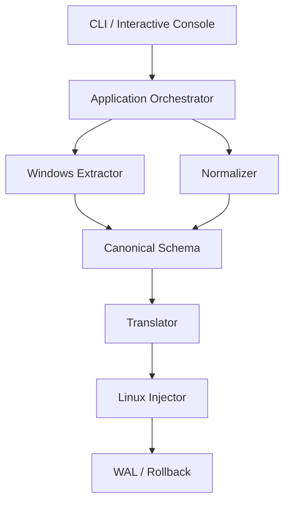
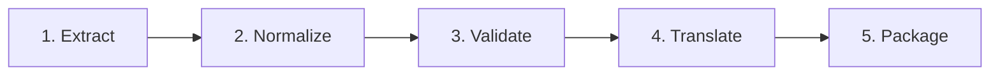
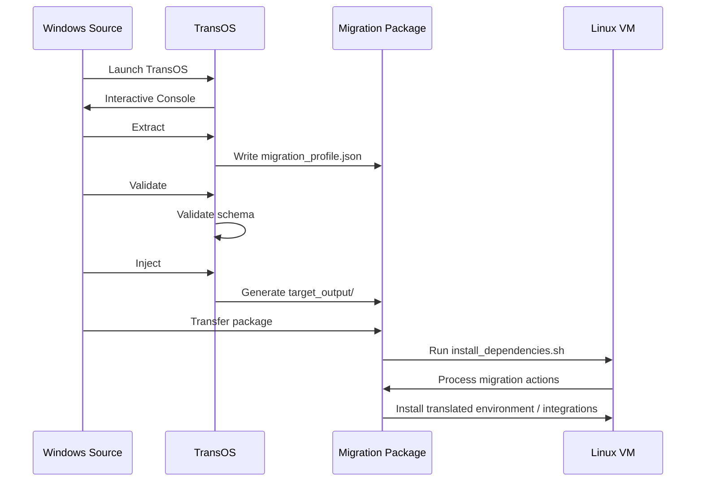

<div align="center">

# TransOS

### Cross-Platform Environment State & Configuration Migration Engine

**Bridging Worlds, Preserving You.**

[](https://go.dev/)
[](#)
[](#canonical-migration-profile)
[](#build-from-source)
[](#testing)
[](#interactive-console)
[](#license)

<br />

> **Same You. Different OS. No Friction.**

TransOS is a user-space migration engine that discovers Windows environment and configuration state, converts it into a canonical migration profile, translates transferable state toward Linux semantics, and generates a Linux-side migration package.

<br />

**Windows Source → Canonical Profile → Translation → Linux Migration Package**

</div>

---

## Table of Contents

- [Overview](#overview)
- [The Problem](#the-problem)
- [What TransOS Does](#what-transos-does)
- [Current MVP](#current-mvp)
- [Architecture](#architecture)
- [Migration Pipeline](#migration-pipeline)
- [Canonical Migration Profile](#canonical-migration-profile)
- [Path Translation](#path-translation)
- [Software Migration Strategy](#software-migration-strategy)
- [Transactional Safety](#transactional-safety)
- [Generated Artifacts](#generated-artifacts)
- [Project Structure](#project-structure)
- [Requirements](#requirements)
- [Installation & Setup](#installation--setup)
- [Usage Guide](#usage-guide)
- [Interactive Console](#interactive-console)
- [Demo Workflow](#demo-workflow)
- [What Is Migrated](#what-is-migrated)
- [Current Limitations](#current-limitations)
- [Roadmap](#roadmap)
- [Development](#development)
- [Testing](#testing)
- [Troubleshooting](#troubleshooting)
- [Academic / Systems Context](#academic--systems-context)
- [Contributing](#contributing)
- [License](#license)
- [Project Status](#project-status)

---

## Overview

Moving from Windows to Linux is rarely just a matter of copying personal files.

A user's working environment is distributed across:

- environment variables;
- executable search paths;
- user directories;
- application installations;
- application-specific configuration;
- Windows Registry state;
- shell configuration;
- theme information;
- development toolchains;
- temporary and runtime state;
- filesystem locations.

Traditional migration approaches generally focus on files or full-system images.

**TransOS takes a different approach:**

> capture the transferable state of a user's environment, represent it in a platform-neutral structure, and reconstruct the transferable parts on a different operating system.

The project is intentionally **user-space** and **dependency-light**. The core migration engine is implemented in Go and produces portable migration artifacts instead of requiring a persistent background daemon or a kernel-level component.

---

## The Problem

A Windows → Linux migration can involve several incompatible representations.

For example:

```text
Windows

C:\Users\Alice\AppData\Roaming
C:\Program Files\
C:\Users\Alice\go\bin
%USERPROFILE%\Documents

                ↓

Linux

/home/alice/.config
/usr/local / opt / package-managed locations
/home/alice/go/bin
/home/alice/Documents
```

The difficulty is not simply moving strings from one file to another.

The migration system needs to determine:

```text
What was discovered?
        ↓
What does it represent?
        ↓
Is it transferable?
        ↓
What is the Linux equivalent?
        ↓
How should it be applied?
        ↓
Can the operation be reversed?
```

That is the central engineering problem addressed by TransOS.

---

# What TransOS Does

TransOS currently follows this conceptual architecture:

```text
Windows Source
      │
      ▼
Discovery / Extraction
      │
      ▼
Normalization
      │
      ▼
Canonical Migration Profile
      │
      ▼
Semantic Translation
      │
      ▼
Linux Migration Package
      │
      ▼
Linux Target
```

The current MVP supports:

- Windows environment extraction;
- installed software discovery;
- selected Windows Registry extraction;
- theme information extraction;
- canonical JSON migration profiles;
- typed environment representation;
- semantic Windows path parsing;
- Windows → POSIX path translation;
- Linux environment artifact generation;
- shell integration artifacts;
- native Linux dependency generation for selected software;
- alternative/manual/unsupported migration classification;
- WAL-backed artifact generation;
- rollback of generated file mutations;
- persistent interactive CLI mode.

---

# Current MVP

## Implemented

| Capability | Status |
|---|---:|
| Windows environment extraction | ✅ |
| Persistent user environment extraction | ✅ |
| Installed software discovery | ✅ |
| Windows Registry discovery | ✅ |
| Theme information discovery | ✅ |
| Canonical migration profile | ✅ |
| Schema validation | ✅ |
| Semantic Windows path analysis | ✅ |
| Windows → POSIX path translation | ✅ |
| Linux environment artifact generation | ✅ |
| Shell profile integration artifacts | ✅ |
| Linux dependency/application package generation | ✅ |
| WAL-backed file operations | ✅ |
| Rollback command | ✅ |
| Persistent interactive console | ✅ |
| Dependency-free ANSI terminal UI | ✅ |

## In progress / next

| Capability | Status |
|---|---:|
| Software identity analyzer | 🟡 Next |
| Migration planner | 🟡 Next |
| Native Linux apply engine | 🟡 Next |
| Migration verification | 🟡 Next |
| Deeper application configuration migration | 🟡 Planned |
| Browser profile migration | 🟡 Planned |
| Multi-distro package strategies | 🟡 Planned |
| Checkpoints / recovery workflows | 🟡 Planned |

---

# Architecture

## High-Level System Architecture


## Internal Software Architecture



### Architectural principle

TransOS separates:

```text
Extract
≠
Normalize
≠
Translate
≠
Plan
≠
Apply
≠
Verify
```

This separation allows the canonical migration profile to remain independent from a specific target operating system.

---

# Migration Pipeline

## Current MVP pipeline



## Planned complete pipeline


The current release stops before full native Linux application and verification. Those stages are part of the planned complete migration engine.

---

# Canonical Migration Profile

The canonical migration profile is the central interchange format between source extraction and target-side migration.

Current schema version:

```text
2.0.0
```

A simplified profile structure is:

```json
{
  "metadata": {},
  "source_system": {},
  "environment": [],
  "software": [],
  "registry": [],
  "theme": {},
  "shell": {},
  "filesystem": []
}
```

## Why a canonical profile?

Without an intermediate representation:

```text
Windows extractor
       ↓
Linux-specific logic
       ↓
hard-coded transformation
```

With TransOS:

```text
Windows extractor
       ↓
Canonical Migration Profile
       ↓
Linux translator / planner
       ↓
Target package
```

This allows additional target operating systems to be added without rewriting the extraction layer.

---

# Path Translation

Windows path semantics are not directly equivalent to Linux path semantics.

TransOS therefore introduces a semantic path analysis layer.

Examples:

```text
C:\Users\Alice
        ↓
/mnt/c/Users/Alice
```

```text
%USERPROFILE%\AppData\Roaming
        ↓
$HOME/.config
```

```text
%USERPROFILE%\AppData\Local
        ↓
$HOME/.local/share
```

```text
C:\Users\Alice\AppData\Local\Temp
        ↓
/tmp
```

The translator also handles:

- Windows drive paths;
- UNC paths;
- embedded `%VARIABLE%` references;
- path lists;
- Windows `;` separators;
- Linux `:` path-list separators;
- conservative handling of unknown locations.

The semantic path engine is intentionally conservative: a path is not considered equivalent merely because it can be syntactically rewritten.

---

# Software Migration Strategy

Software migration is not a simple name-to-name replacement.

A Windows application can fall into several categories:

```text
Native Linux equivalent
        │
        ├── direct package / installer
        │
        ├── compatibility layer
        │
        ├── alternative application
        │
        ├── manual installation
        │
        └── unsupported
```

For example, the current package generator may produce native Linux installation actions for selected software while classifying others for manual or alternative handling.

Conceptually:

```text
Windows application
        ↓
Identity recognition
        ↓
Migration strategy
        ↓
Linux target action
```

The roadmap introduces a dedicated software identity/analyzer layer so that these decisions become richer, explainable, and independently testable.

---

# Transactional Safety

Generated migration artifacts are protected by the TransOS Write-Ahead Log (WAL).

The basic model is:

```text
Operation requested
        ↓
WAL intent recorded
        ↓
Existing target backed up when required
        ↓
Filesystem operation performed
        ↓
Transaction state persisted
```

The WAL currently supports generated file operations and rollback.

```text
transos rollback
```

restores files that were backed up or removes files created by the transaction.

The WAL is currently a prototype transaction/recovery layer. More advanced recovery semantics, checkpoints, locking, permissions, ownership, and filesystem metadata handling are planned.

---

# Generated Artifacts

Running:

```text
transos inject
```

generates a target package under:

```text
target_output/
```

Typical generated contents:

```text
target_output/
├── install_dependencies.sh
├── transos_env.conf
├── .bashrc
├── .zshrc
└── transos.wal
```

## `install_dependencies.sh`

Linux-side migration/dependency processing script.

It currently supports selected native package strategies and reports applications that require:

- alternative software;
- manual installation;
- compatibility review;
- unsupported handling.

## `transos_env.conf`

Translated Linux shell environment configuration.

## `.bashrc`

Generated Bash integration artifact.

## `.zshrc`

Generated Zsh integration artifact.

## `transos.wal`

Transaction and rollback history for generated file operations.

> `target_output/` is runtime-generated output and is intentionally excluded from source control.

---

# Project Structure

```text
TransOS/
│
├── cmd/
│   └── transos/
│       └── main.go
│
├── internal/
│   ├── app/
│   │   └── runner.go
│   │
│   ├── cli/
│   │   ├── help.go
│   │   └── runner.go
│   │
│   ├── extractor/
│   │   └── windows.go
│   │
│   ├── injector/
│   │   ├── linux.go
│   │   └── shell.go
│   │
│   ├── normalizer/
│   │   ├── profile.go
│   │   └── profile_test.go
│   │
│   ├── schema/
│   │   └── model.go
│   │
│   ├── translator/
│   │   ├── ast.go
│   │   ├── package_mapper.go
│   │   ├── path_semantics.go
│   │   └── path_semantics_test.go
│   │
│   └── wal/
│       └── logger.go
│
├── .gitignore
├── go.mod
├── go.sum
├── install.sh
├── README.md
│
└── runtime-generated:
    ├── migration_profile.json
    ├── target_output/
    └── transos.exe
```

---

# Requirements

## Source system

Currently demonstrated primarily on:

- Windows 10 / Windows 11
- PowerShell
- Windows CMD

## Target system

The current generated migration package is intended for Linux systems, with the easiest demonstration path being:

- Ubuntu
- Debian-derived distributions

Some generated package strategies depend on the target's available package manager or installation tools.

## Build requirements

- Git
- Go toolchain
- Windows for the current Windows extraction implementation

Check the installed Go version:

```powershell
go version
```

---

# Installation & Setup

## 1. Clone the repository

```powershell
git clone https://github.com/Adityaraj-Gupta-JI/TransOS.git
cd TransOS
```

## 2. Verify the Go environment

```powershell
go version
```

## 3. Build TransOS

```powershell
go build -o transos.exe ./cmd/transos
```

## 4. Launch TransOS

```powershell
.\transos.exe
```

This opens the persistent interactive migration console.

---

# Usage Guide

TransOS supports both direct commands and persistent interactive mode.

## Direct commands

### Launch interactive console

```powershell
.\transos.exe
```

or:

```powershell
.\transos.exe interactive
```

### Extract source state

```powershell
.\transos.exe extract
```

This captures current source state into:

```text
migration_profile.json
```

### Validate the profile

```powershell
.\transos.exe validate
```

### Preview the profile

```powershell
.\transos.exe preview
```

### Generate Linux migration artifacts

```powershell
.\transos.exe inject
```

### Run the current complete MVP pipeline

```powershell
.\transos.exe run-all
```

Current sequence:

```text
Extract
   ↓
Validate
   ↓
Generate Linux Package
```

### Show package information

```powershell
.\transos.exe outputs
```

### Show migration status

```powershell
.\transos.exe status
```

### Roll back generated file changes

```powershell
.\transos.exe rollback
```

### Show help

```powershell
.\transos.exe help
```

---

# Interactive Console

The interactive mode is persistent.

```text
transos [P✓ O✓ W✓]>
```

The state indicators represent:

```text
P = Migration Profile
O = Output Package
W = WAL
```

## Numeric shortcuts

```text
1   extract
2   validate
3   preview
4   inject
5   run-all
6   rollback
7   outputs
8   help
9   status
10  about
0   exit
```

## Named commands

```text
extract
validate
preview
inject
import
run-all
rollback
outputs
files
status
state
about
pwd
dir
ls
menu
home
clear
cls
help
version
translate
exit
quit
q
```

## Example interactive session

```text
PS> .\transos.exe

TRANSOS

transos [P○ O○ W○]> 1

[EXTRACTION]
Environment variables : 93 discovered
Software entries      : 37 discovered
Registry entries      : 22 discovered

transos [P✓ O○ W○]> 2

[VALIDATION]
Profile : VALID
Schema  : 2.0.0

transos [P✓ O○ W○]> 4

[PACKAGE GENERATION]
Environment configuration : generated
Shell hook artifacts      : generated
Linux dependency installer: generated
WAL transaction           : recorded

transos [P✓ O✓ W✓]> 7

Generated Migration Package
...

transos [P✓ O✓ W✓]> q
```

The console remains active until:

```text
exit
quit
q
0
```

---

# Demo Workflow

The recommended demonstration is a Windows → Linux VM workflow.



## Recommended live demo

### Windows

```powershell
git clone https://github.com/Adityaraj-Gupta-JI/TransOS.git
cd TransOS
go build -o transos.exe ./cmd/transos
.\transos.exe
```

Then inside TransOS:

```text
1
2
4
7
0
```

This demonstrates:

```text
Extraction
→ Validation
→ Migration Package Generation
→ Artifact Inspection
```

### Linux VM

Transfer:

```text
target_output/
```

into the Linux VM.

Then:

```bash
cd target_output
chmod +x install_dependencies.sh
./install_dependencies.sh
```

The generated script detects the target Linux environment, processes supported migration actions, and prints a final migration report.

---

# What Is Migrated

## Currently supported discovery

### Environment

- process environment variables;
- persistent user environment variables;
- path-like values;
- directories;
- locale-like values;
- source metadata.

### Software

- installed application inventory;
- version;
- publisher;
- architecture when available;
- installation location when available;
- migration status.

### Registry

Current extraction focuses on transferable user-oriented registry information such as Windows user shell-folder state.

### Theme

Selected Windows system color information is captured into the canonical profile.

### Paths

Windows path structures are analyzed and transformed toward Linux semantics where meaningful.

### Shell

Generated shell integration artifacts can load translated environment configuration.

### Transaction state

Generated artifacts are recorded in the WAL for rollback.

---

# Migration Classification

TransOS does not assume that every Windows artifact has a one-to-one Linux equivalent.

A migration candidate may therefore be classified as:

```text
EXACT
CONVERTIBLE
NATIVE_EQUIVALENT
COMPATIBILITY_LAYER
MANUAL
UNSUPPORTED
UNKNOWN
```

The package generator may additionally produce target-side actions such as:

```text
native reinstall
alternative application
manual installation
compatibility review
unsupported
```

This distinction is intentional.

A migration engine should prefer:

> **accurate classification over false equivalence.**

---

# Current Limitations

TransOS is an evolving migration engine and the current MVP has important boundaries.

### Application migration is not yet universal

Discovering an application does not mean its complete application state, account state, license state, cache, extensions, or platform-specific configuration is already migrated.

### Linux application installation is currently selective

The generated package has native installation strategies for selected software and classifies other applications for alternative or manual handling.

### Distro support is not universal

The current package generator primarily targets Debian/Ubuntu-style systems while beginning to recognize other package-manager environments.

### Linux apply is not yet the final migration engine

The current MVP generates and executes selected migration actions, but a complete target-side planner/apply/verification framework remains part of the roadmap.

### Verification is limited

A full post-migration verification engine is planned but not yet complete.

### Registry equivalence is not direct

Windows Registry data cannot generally be copied into Linux directly. TransOS therefore captures transferable semantic information instead of attempting a raw Registry transplant.

### Hardware and device state are outside the current MVP

Drivers, device firmware, hardware-specific settings, Windows services, kernel state, and similar platform-specific state are not directly migrated.

---

# Roadmap

## Phase 0 — Foundation

- [x] Go CLI foundation
- [x] Application orchestration layer
- [x] Canonical profile schema
- [x] Windows extraction
- [x] Registry extraction
- [x] Environment extraction

## Phase 1 — Translation

- [x] Path AST
- [x] Semantic path classification
- [x] Windows → POSIX translation
- [x] Path-list conversion
- [x] Normalization

## Phase 2 — Migration Package

- [x] Linux environment artifact
- [x] Shell integration
- [x] Software dependency generation
- [x] WAL-backed artifact generation
- [x] Rollback

## Phase 3 — Interactive Experience

- [x] Persistent command shell
- [x] Numeric command shortcuts
- [x] Migration dashboard
- [x] Runtime migration state
- [x] Artifact inspection commands

## Phase 4 — Intelligent Migration

- [ ] Software identity analyzer
- [ ] Evidence-based software classification
- [ ] Migration decision engine
- [ ] Migration planner
- [ ] Target-specific package manifest

## Phase 5 — Linux Apply

- [ ] Native Linux apply engine
- [ ] Application configuration migration
- [ ] Target environment reconstruction
- [ ] Target-side permission handling
- [ ] Multi-distro strategies

## Phase 6 — Verification & Recovery

- [ ] Post-migration verification
- [ ] Integrity checks
- [ ] Migration checkpoints
- [ ] Failure recovery
- [ ] Resume interrupted migration
- [ ] Expanded rollback model

## Future

- [ ] Browser profiles
- [ ] Broader application state
- [ ] Additional Linux distributions
- [ ] Network transfer workflows
- [ ] Migration package signing
- [ ] Advanced compatibility-layer support

---

# Development

## Format code

```powershell
gofmt -w .
```

## Run tests

```powershell
go test ./...
```

## Build

```powershell
go build -o transos.exe ./cmd/transos
```

## Run directly during development

```powershell
go run ./cmd/transos
```

## Extract during development

```powershell
go run ./cmd/transos extract
```

---

# Testing

The repository currently includes automated tests for the normalization and semantic path translation layers.

Run the complete test suite:

```powershell
go test ./...
```

The complete repository should also build successfully:

```powershell
go build -o transos.exe ./cmd/transos
```

---

# Troubleshooting

## `go build` fails

Check:

```powershell
go version
go env
```

Then run:

```powershell
go test ./...
```

before rebuilding.

## `migration_profile.json` is invalid

Run:

```powershell
.\transos.exe validate
```

The validation layer reports schema or required-field errors.

## `target_output/` contains old artifacts

Regenerate it:

```powershell
Remove-Item .\target_output -Recurse -Force
.\transos.exe inject
```

## Linux installer is not executable

On Linux:

```bash
chmod +x install_dependencies.sh
./install_dependencies.sh
```

## Linux package manager differs

The generated package detects supported package-manager availability. Applications without an applicable native strategy are reported for alternative or manual handling rather than being blindly installed.

## Interactive console exits immediately

Make sure you are launching the newly built executable:

```powershell
go build -o transos.exe ./cmd/transos
.\transos.exe
```

Interactive mode is expected to remain active until `exit`, `quit`, `q`, or `0`.

---

# Academic / Systems Context

TransOS explores cross-platform operating-system state migration as a **user-space systems engineering problem**.

The project combines concepts from:

- operating systems;
- systems programming;
- configuration management;
- environment modeling;
- filesystem semantics;
- platform abstraction;
- transactional operations;
- migration planning;
- software compatibility analysis.

The project is intentionally designed around a canonical intermediate representation instead of binding every source platform directly to every target platform.

This can be expressed as:

```text
Source Platform
      ↓
Canonical State Representation
      ↓
Target Transformation
```

rather than:

```text
Windows → Linux
Windows → Other
Other → Linux
Other → Other
...
```

The canonical representation provides a scalable architecture for extending the migration engine.

---

# Contributing

TransOS is currently developed as an academic/experimental systems project.

For major changes, preserve the architectural separation:

```text
CLI
 ↓
Application
 ↓
Domain modules
```

Avoid placing migration logic directly into the CLI presentation layer.

When adding a migration capability:

1. define the canonical representation;
2. implement source extraction;
3. normalize the state;
4. translate semantics;
5. generate/apply target actions;
6. add tests;
7. document the resulting behavior.

---

# License

This repository is proprietary software.

All rights are reserved by the project owner.

No part of this project, including source code, documentation, generated artifacts, or associated materials, may be copied, modified, distributed, sublicensed, published, or used commercially without prior written permission from the project owner.

Copyright (c) 2026 TransOS Owner. All rights reserved.

---

# Project Status

**Current status: MVP / Demo Ready**

The current MVP demonstrates:

```text
Windows
   ↓
Real State Extraction
   ↓
Canonical Migration Profile
   ↓
Validation
   ↓
Path Translation
   ↓
Linux Migration Package
   ↓
Transactional Artifact Generation
   ↓
Linux-side Migration Script
```

The immediate engineering focus is extending the migration intelligence and target-side execution layers.

---

<div align="center">

### TransOS

**Bridging Worlds, Preserving You.**

`Windows → Profile → Translation → Linux`

</div>
